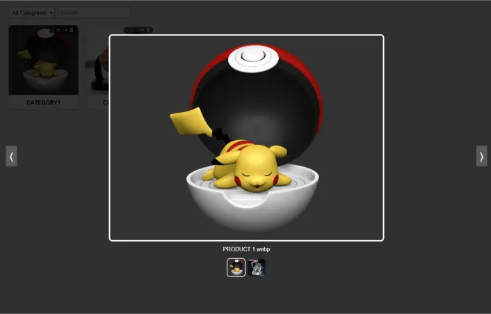

# 🖼 Folder Viewer (Express.js)

This project automatically **scans your local folder directories** and displays `.webp` preview images in a **filterable, searchable gallery** within the browser.  
Images can be browsed in a **modal with thumbnail-based carousel navigation**, including cross-folder image navigation.

> **Note:**  
> This project was originally designed for **my own 3D model collection** (mostly miniature figures for 3D printing).  
> The folder scanning, image previews, and modal navigation features were tailored for my workflow of organizing, previewing, and selecting models before printing.  
> However, it can be adapted for **any kind of image-based folder structure**, not just 3D model previews.


## 🚀 Features
- 📂 **Automatic folder scanning** – Recursively scans the given directory for categories and model folders.
- 🖼 **Image preview** – Automatically lists `.webp` preview images.
- 🔍 **Filtering & search** – Filter by category or search by model name.
- 📊 **File & photo counters** – Displays total `.webp` count and total files (including subfolders) in the top-right badge of each card.
- 🖱 **Modal viewer** – Click on a card to view the model images in a modal.
- 🎯 **Carousel navigation** – Navigate between images using arrow buttons or keyboard arrow keys.
- 🖼 **Thumbnail navigation** – Click on any thumbnail in the modal to jump directly to that image.
- ⌨ **Keyboard shortcuts**:
  - `Esc` → Close modal
  - `←` / `→` → Previous / next image

---

## 📂 Folder Structure
```
📦 project-directory
┣ 📂 CATEGORY 1
┃ ┣ 📂 PRODUCT (1)
┃ ┃ ┣ PRODUCT (1a).webp
┃ ┃ ┣ PRODUCT (1b).webp
┃ ┃ ┗ ...
┃ ┣ 📂 PRODUCT (2)
┃ ┃ ┣ ...
┣ 📂 CATEGORY 2
┃ ┣ 📂 PRODUCT (1)
┃ ┃ ┣ ...
┣ server.js
```

## 🔧 Installation
### 1️⃣ Clone the repository
```bash
git clone https://github.com/kagitmiadam/folder-viewer.git
cd folder-viewer
```

### 2️⃣ Install dependencies

```bash
npm install
```

### 3️⃣ Place your model folders

Put your category folders (e.g., MINIATURES, ANIME, PRODUCT) inside the project directory, alongside server.js.

### ▶️ Usage

Start the server:
```
node server.js
```

Open your browser and go to:
```
http://localhost:3000
```

### 🛠 Tech Stack

- Node.js – Backend server
- Express.js – API & static file serving
- Vanilla JavaScript – Frontend rendering & modal logic
- HTML + CSS – UI layout & styling

## ⚠ Performance Issues
While the project works well for small to medium-sized collections, there are a few performance considerations:

- **Modal loading delay:**  
  Opening a modal with a **large number of images** may cause slow loading times, especially if all images are fetched at once.

- **Initial page load time:**  
  If the base directory contains **hundreds of folders** with many images, the first load might be slower because the server must scan and return all file data.

- **Browser memory usage:**  
  Very large `.webp` files or high-resolution images may increase browser memory usage, especially when multiple modals are opened during a single session.

- **Lack of lazy loading:**  
  Currently, images are not lazy-loaded; all thumbnails are fetched immediately. This can be optimized in the future.

If you encounter other performance issues, **please open an issue** on GitHub or submit a pull request with improvements.

**Tip:** For larger collections, .webp images are recommended for faster load times.


### 📜 License

MIT License – feel free to use, modify, and distribute.  
If this project saves you time, **a little credit or a shout-out would make my day** 😎.

### 🌟 Preview



